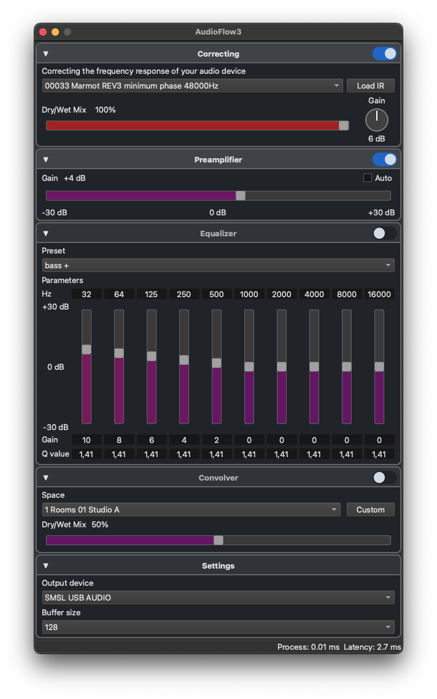

# AudioFlow3

Real-time audio processor for macOS that captures system audio via a virtual driver (BlackHole), applies a signal correction chain, and outputs the processed result to the selected audio device.

## Table of Contents
- [Requirements](#requirements)
- [Installation Instructions](#installation-instructions)
- [Uninstallation Instructions](#uninstallation-instructions)
- [User Interface](#user-interface)
- [Signal Chain](#signal-chain)
- [Features](#features)
- [Building](#building)
- [Issues](#issues)
- [Contributing](#contributing)
- [Credits](#credits)
- [License](#license)

## Requirements

- macOS 13.0+
- [BlackHole](https://existential.audio/blackhole/) virtual audio driver (16ch or 2ch)
- Qt 6.5+ (build only)

## Installation Instructions

You can just download zip archive with latest version from https://github.com/DrMoriarty/AudioFlow3/releases

Or run `brew install --cask drmoriarty/audioflow/audioflow` It also installs `blackhole-2ch` as a dependency.

Reboot the system. It is required by BlackHole driver.

## Uninstallation Instructions

Remove `AudioFlow3.app` from your `/Application` directory as usual. Remove `BlackHole.driver` from `/Library/Audio/Plug-Ins/HAL/` if you dont need it.

Or use `brew uninstall audioflow` if you used brew for installation.

## User Interface


## Signal Chain

Correction → Preamplifier → Equalizer → Convolution Reverb

Each block is toggled on/off. Signal flows top-to-bottom.

## Features

### Correction

- Loads an impulse response (IR) file to compensate for audio device frequency response anomalies
- Dry/Wet mix control
- Post-gain knob (0 / 3 / 6 / 9 / 12 dB)
- IR files can be loaded from disk; the 5 most recent are remembered

### Preamplifier

- Manual gain control (-30 dB to +30 dB)
- Auto-gain mode: automatically adjusts gain to maintain -14 dBFS target level based on input signal RMS

### Equalizer

- 10-band parametric EQ with configurable frequency, Q, and gain per band
- Built-in presets: bass +/-, treble +/-, vocal +/-, flat

### Convolution Reverb

- Loads any WAV impulse response file
- Dry/Wet mix control

### Settings

- Select output audio device
- Adjust buffer size (64 -- 16384 samples)

### General

- All settings are persisted in `~/Library/Application Support/AudioFlow3/config.json`
- Window state (expanded/collapsed blocks) is remembered across sessions
- Collapsible UI blocks with animated expand/collapse
- Dock reopen: closing the window hides the app; clicking the dock icon restores it
- Cmd+Q or Quit from menu/dock closes the app and cleans up audio resources

## Building

```bash
cmake -B build -S .
cmake --build build
./build/AudioFlow3.app/Contents/MacOS/AudioFlow3
```

To build universal (arm64 + x86_64):

```bash
cmake -B build -S . -DCMAKE_OSX_ARCHITECTURES="arm64;x86_64"
cmake --build build
```

## Issues

Original Audioflow isn't compatible with bluetooth audio devices. And I didn't tested AudioFlow3 with it. So report me if you have problems.

## Contributing

All contributions are welcome. Whether you're fixing a bug, adding a new feature, or have an issue, feel free to open a pull request/issue/etc.

## Credits

This project uses C++ code from the original AudioFlow project, which you can find here: https://github.com/jeremicna/AudioFlow

Also this project uses the BlackHole Audio Loopback Driver by @ExistentialAudio to capture system audio. https://github.com/ExistentialAudio/BlackHole

## License

MIT

